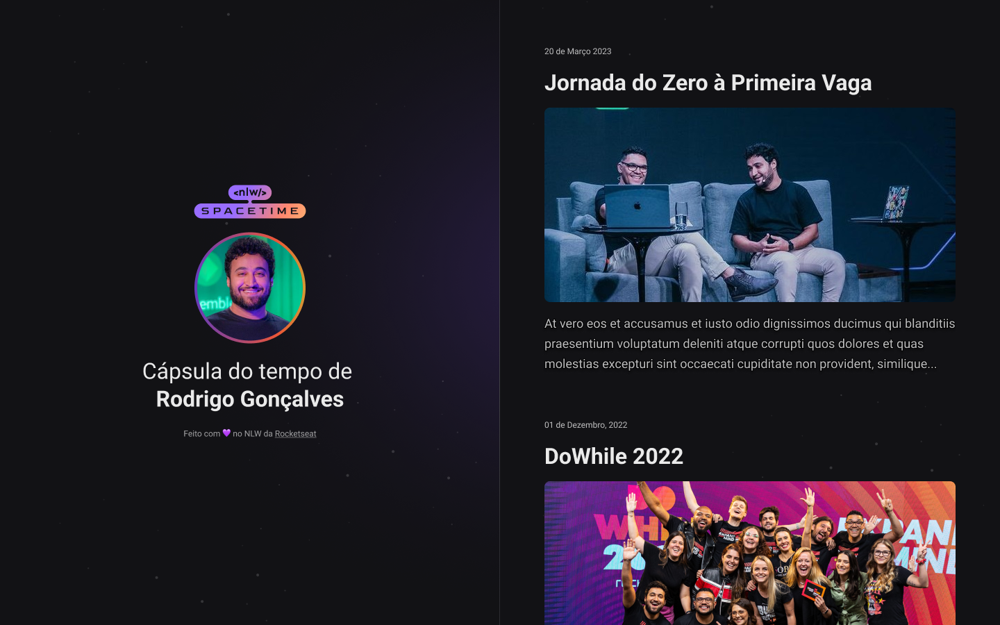

   

## 🖥️ Projeto

Esse é um projeto web responsivo de uma capsula do tempo para exibir memorias de uma linha do tempo.

## Tecnologias

Esse projeto foi desenvolvido durante o NLW da rocketseat com as seguintes tecnologias:

- HTML
- CSS
- Git e GitHub

## Layout

Voce pode visualizar o layout do projeto atraves?
[desse link](<https://www.figma.com/file/5dgPob9Opa7Nc7cRGACoyJ/C%C3%A1psula-do-tempo-%E2%80%A2-Trilha-Explorer-(Community)?type=design&node-id=352%3A8&t=O572HfJZdGefvFw3-1>).
É necessario ter uma conta no [Figma](https://www.figma.com)
